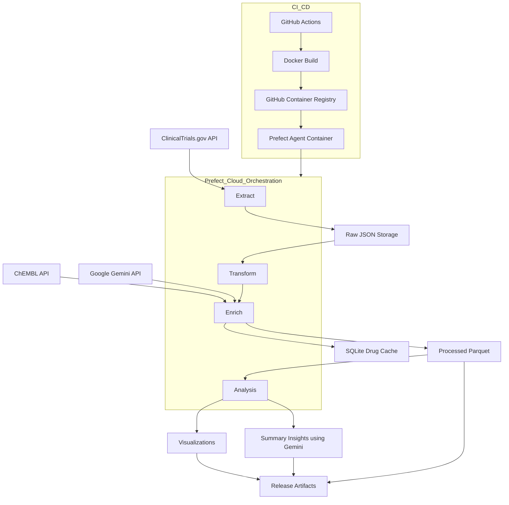

# Clinical Trials Data Pipeline

An end-to-end data pipeline for extracting, enriching, analyzing, and visualizing clinical trial data from ClinicalTrials.gov.

## Architecture




## Features

* ✅ Extracts **industry-sponsored**, **interventional**, human studies for a specified disease
* 🧠 Enriches interventions with **drug modality and target info** using:

  * 🔬 Primary: ChEMBL Python client
  * 🤖 Fallback: Google Gemini API
* 📦 Caches enrichment to **SQLite** to avoid redundant lookups
* 📊 Generates **interactive (Plotly)** and **static (Matplotlib)** visualizations
* 📝 Produces detailed **LLM-based insights reports** with Gemini
* ⚙️ Containerized using **Docker** and deployed with **GitHub Actions**
* ☁️ Orchestrated using **Prefect Cloud** (optionally migratable to Airflow or GKE)
* 📁 Release artifacts are stored locally or in cloud-ready structure

## Quick Start

### Prerequisites

* Python 3.12
* [Poetry](https://python-poetry.org/) for dependency management
* [Prefect 2](https://docs.prefect.io/) for orchestration
* Google Gemini API key (used if ChEMBL enrichment fails)

### Setup

1. Clone the repository

```bash
git clone https://github.com/jibinb961/clinical_trial_pipeline.git
cd clinical_trial_pipeline
```

2. Install dependencies

```bash
poetry install
```

3. Configure environment variables (or create a `.env` file)

```bash
DISEASE="Familial Hypercholesterolemia"
YEAR_START=2008
YEAR_END=2023
GEMINI_API_KEY="your-api-key"
MAX_STUDIES = 100 # can be modified
MAX_PAGES=2 #can be modified
PREFECT_API_KEY="your-prefect-api-ke"
PREFECT_WORKSPACE="workspace_slug_here"

# When running inside Docker
BASE_PATH=/app

# When running locally, comment it out or set to current dir
 BASE_PATH=.

```

4. Run the pipeline

```bash
poetry run python -m src.pipeline.flow
```

### Using Docker (with Prefect Cloud Agent)

```bash
docker-compose up
```

## CI/CD (GitHub Actions)

This repository includes a GitHub Actions workflow that:

* Runs tests with Pytest
* Builds and validates Docker image
* Publishes image to **GitHub Container Registry (GHCR)**

> You'll need to configure `secrets.GITHUB_TOKEN` for GHCR push access.

## Output Organization & Run Directories

Each pipeline run creates a dedicated output directory under `data/`, named as:

```
data/<disease>_<timestamp>/
```

For example:
```
data/huntingtons_disease_2025-05-15_041842/
```

Inside each run directory, outputs are organized into subfolders:
- `figures/` — All generated plots (PNG, HTML, etc.)
- `processed/` — Processed data files (CSV, Parquet, enrichment reports, etc.)
- `raw/` — Raw filtered data (JSON)
- `cache/` — (If used) Any run-specific cache files

### Example File Structure

```
clinical_trial_pipeline/
├── data/
│   ├── figures/
│   │   ├── age_quartiles_box_<timestamp>.png
│   │   ├── modality_by_phase_distribution_<timestamp>.html
│   │   └── ... (other plots and HTMLs)
│   ├── processed/
│   │   ├── clinical_trials_<timestamp>.csv
│   │   ├── enrichment_report_<timestamp>.csv
│   │   ├── trials_enriched_<timestamp>.parquet
│   │   ├── insights_<timestamp>.md
│   │   └── ... (other processed outputs)
│   ├── raw/
│   │   ├── <timestamp>/
│   │   │   └── filtered_<timestamp>.json
│   │   └── .gitkeep
│   ├── cache/
│   └── drug_cache.sqlite
├── app/
│   └── streamlit_app.py
├── src/
│   └── pipeline/
│       ├── flow.py
│       ├── etl.py
│       ├── enrich.py
│       ├── analysis.py
│       └── ...
└── ...
```

- All **figures** (plots, HTMLs, PNGs) are in `data/figures/`.
- All **processed data** (CSV, Parquet, enrichment reports, insights) are in `data/processed/`.
- **Raw data** for each run is in a timestamped subfolder under `data/raw/`.
- **Cache** and **SQLite drug cache** are in `data/cache/` and `data/drug_cache.sqlite`.

---

## Interactive Dashboard

A Streamlit dashboard is provided for interactive exploration and visualization of pipeline outputs.

### Usage

1. **Start the dashboard:**
   ```bash
   poetry run streamlit run app/streamlit_app.py
   ```


2. **Features:**
   - **Run Selection:** Use the sidebar dropdown to select a specific pipeline run (by disease and timestamp).
   - **File Type & File Selection:** After selecting a run, choose the file type (HTML, PNG, Markdown, CSV) and then the specific file to view.
   - **Visualization:** The dashboard will render the selected file appropriately (interactive plots, images, tables, or markdown).

---

## Troubleshooting

- **FileNotFoundError during plotting:**  
  If you see errors about missing directories when saving plots, ensure that all output subdirectories (e.g., `figures/`) are created before writing files. You can add:
  ```python
  output_dir.mkdir(parents=True, exist_ok=True)
  ```
  before any file save operation.

- **Environment Variables:**  
  Make sure all required environment variables are set, especially when running in Docker or CI/CD.

- **Prefect Cloud:**  
  If using Prefect Cloud, ensure your API key and workspace slug are set correctly.

---

## Contributing

Contributions are welcome! Please open issues or pull requests for bug fixes, new features, or documentation improvements.

## Prefect Cloud with Docker

You can orchestrate and schedule pipeline runs using [Prefect Cloud](https://www.prefect.io/cloud/) and Docker.

### Steps

1. **Create a Prefect Cloud Account:**
   - Go to [Prefect Cloud](https://app.prefect.cloud/) and sign up.
   - Create a workspace.

2. **Get Your API Key and Workspace Slug:**
   - In Prefect Cloud, go to your account settings and generate a `PREFECT_API_KEY`.
   - Find your workspace slug (e.g., `your-org/your-workspace`).

3. **Set Environment Variables:**
   - Add these to your `.env` file or environment:
     ```bash
     PREFECT_API_KEY=your-prefect-api-key
     PREFECT_WORKSPACE=your-org/your-workspace
     ```

4. **Run with Docker Compose:**
   - Build and start the agent and deployment:
     ```bash
     docker-compose up -d
     ```
   - This will build the Docker image, push the deployment to Prefect Cloud, and start a Prefect agent.

5. **Schedule and Monitor Runs:**
   - Go to your Prefect Cloud workspace.
   - You can now schedule pipeline runs, monitor status, and view logs directly from the Prefect UI.

---
