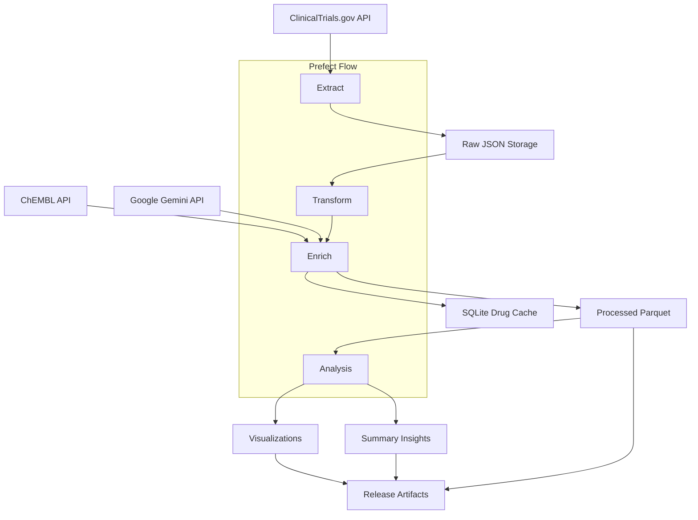

# Clinical Trials Data Pipeline

An end-to-end data pipeline for extracting, enriching, analyzing, and visualizing clinical trial data from ClinicalTrials.gov.

## Architecture



## Features

- Extracts industry-sponsored, interventional studies for a specified disease
- Enriches trial data with drug modality and target information using ChEMBL Python client
- Transforms and loads data into structured formats
- Analyzes and visualizes trial data with interactive and static charts
- Delivers artifacts for reporting and sharing

## Quick Start

### Prerequisites

- Python 3.12
- Poetry (for dependency management)
- Prefect 2 (for workflow orchestration)
- Google Gemini API key (for fallback drug enrichment when ChEMBL has no data)

### Setup

1. Clone the repository

```bash
git clone https://github.com/yourusername/clinical-trials-pipeline.git
cd clinical-trials-pipeline
```

2. Install dependencies

```bash
poetry install
```

3. Set up environment variables (or create a `.env` file)

```bash
export DISEASE="Familial Hypercholesterolemia"
export YEAR_START=2008
export YEAR_END=2023
export GEMINI_API_KEY="your-api-key"
```

4. Run the pipeline

```bash
poetry run python -m src.pipeline.flow
```

### Using Docker

```bash
docker-compose up
```

## License

MIT 