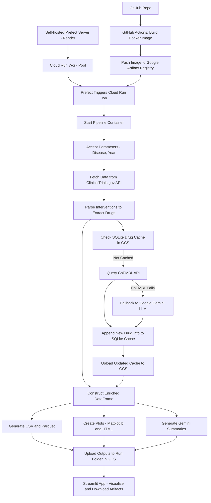

# Clinical Trials Data Pipeline

An end-to-end, cloud-native data pipeline for extracting, enriching, analyzing, and visualizing clinical trial data from ClinicalTrials.gov.

## Architecture



---

## Cloud-Native Workflow Overview

- **Source code** is maintained on GitHub.
- **CI/CD**: On every code push, a GitHub Actions pipeline builds a Docker image and pushes it to Google Artifact Registry, ensuring the latest image is always available for deployment.
- **Orchestration**: A self-hosted Prefect server runs on Render (with a PostgreSQL database for persistence). A Cloud Run work pool is registered with Prefect.
- **Deployment**: When a run is scheduled, Prefect triggers a Google Cloud Run Job, which spins up a container using the latest Docker image from Artifact Registry.
- **Pipeline Execution**: The containerized pipeline fetches clinical trial data, enriches drug information (using a GCS-hosted SQLite cache, ChEMBL API, and Google Gemini), generates outputs, and uploads all artifacts to a run-specific folder in Google Cloud Storage.
- **Visualization**: A Streamlit app visualizes and allows download of all pipeline artifacts directly from GCS.

---

## Quick Start: Cloud-Native Setup

### 1. Prerequisites
- Google Cloud Project with Artifact Registry, Cloud Run, and GCS enabled
- [Render.com](https://render.com/) account for hosting Prefect server
- Python 3.12, Docker, and [Poetry](https://python-poetry.org/) for local development
- Prefect Cloud account (optional, for UI and scheduling)

### 2. CI/CD Pipeline (GitHub Actions)
- On every push, the pipeline:
  - Builds a Docker image from the repo
  - Pushes the image to Google Artifact Registry
- **Configure secrets** in your GitHub repo for GCP authentication

### 3. Self-Hosted Prefect Server on Render
- Deploy a Prefect server on Render using the official Docker image
- Use a managed PostgreSQL database for Prefect persistence
- Expose the Prefect API endpoint for your agents and UI
- Register a Cloud Run work pool in your Prefect server

### 4. Cloud Run Work Pool
- In Prefect, create a Cloud Run work pool that:
  - Uses your Artifact Registry Docker image
  - Has permissions to access GCS and other GCP services
  - Can receive parameters (disease, year, etc.) at runtime

### 5. Environment Variables
- Set the following environment variables in Prefect Cloud (or Render) and your Cloud Run job:
  - `DISEASE` (e.g., "Familial Hypercholesterolemia")
  - `YEAR_START`, `YEAR_END`
  - `GEMINI_API_KEY` (for Google Gemini fallback)
  - `MAX_STUDIES`, `MAX_PAGES`
  - `PREFECT_API_KEY`, `PREFECT_WORKSPACE` (if using Prefect Cloud)
  - `BASE_PATH` (set to `/app` in Docker, or `.` locally)
  - `GCS_BUCKET` (your artifact bucket name)
  - Any other secrets required for GCP and APIs

### 6. Running the Pipeline
- Schedule or trigger a run from your Prefect server UI (hosted on Render)
- The Cloud Run job will:
  - Fetch clinical trial data from ClinicalTrials.gov
  - Extract and enrich drug information (using GCS-hosted SQLite cache, ChEMBL API, and Gemini LLM)
  - Save all results (CSV, Parquet, plots, summaries) to a run-specific folder in your GCS bucket

### 7. Visualizing Results
- Use the provided Streamlit app to:
  - Browse available pipeline runs
  - View and download all generated artifacts (plots, data files, summaries) directly from GCS

---

## Example Environment Variables

```bash
DISEASE="Familial Hypercholesterolemia"
YEAR_START=2008
YEAR_END=2023
GEMINI_API_KEY="your-api-key"
MAX_STUDIES=100
MAX_PAGES=2
PREFECT_API_KEY="your-prefect-api-key"
PREFECT_WORKSPACE="your-org/your-workspace"
BASE_PATH=/app
GCS_BUCKET=clinical-trial-pipeline-artifacts-bucket
```

---

## Prefect Orchestration: Work Pool, Deployment, and Worker

### 1. Create a Cloud Run Work Pool

Run this command to create a Prefect work pool of type Cloud Run:

```bash
poetry run prefect work-pool create --type cloud-run clinical-pipeline-pool
```

### 2. Deploy the Pipeline to the Prefect Server

Deploy your pipeline (using the `prefect.yaml` file) to the Prefect server:

```bash
poetry run prefect deploy --name clinical-flow-deploy
```

### 3. Start the Prefect Worker

Start a Prefect worker that will listen to the Cloud Run work pool:

```bash
prefect worker start --pool 'clinical-pipeline-pool'
```

---

## Running the Streamlit Application Locally

### 1. Set Up Google Cloud Credentials
- Download your GCP service account key as `service_account.json`.
- Place it in a secure location (e.g., the project root or a `.secrets` folder).
- Export the path to this file as an environment variable:

```bash
export GOOGLE_APPLICATION_CREDENTIALS="/absolute/path/to/service_account.json"
```

This is required for the Streamlit app (and any local code) to access Google Cloud Storage.

### 2. Poetry Setup
- Install [Poetry](https://python-poetry.org/) if you haven't already:

```bash
pip install poetry
```

- Install dependencies:

```bash
poetry install
```

### 3. Run the Streamlit App
- Activate the Poetry shell (optional, but recommended):

```bash
poetry shell
```

- Run the Streamlit dashboard:

```bash
poetry run streamlit run app/streamlit_app.py
```

- The app will open in your browser. You can browse and visualize all pipeline artifacts stored in your GCS bucket.

---

## Repository Folder Structure

```
clinical_trial_pipeline/
├── app/
│   └── streamlit_app.py         # Streamlit dashboard for artifact visualization
├── src/
│   └── pipeline/
│       ├── flow.py              # Main pipeline orchestration
│       ├── etl.py               # ETL logic
│       ├── enrich.py            # Drug enrichment logic
│       ├── analysis.py          # Analysis and plotting
│       ├── utils.py             # Utility functions (GCS, timestamp, etc.)
│       └── ...
├── data/                        # (Optional) Local output directory for artifacts
│   ├── figures/                 # Generated plots (PNG, HTML, etc.)
│   ├── processed/               # Processed data files (CSV, Parquet, etc.)
│   ├── raw/                     # Raw data (JSON)
│   ├── cache/                   # Run-specific cache files
│   └── drug_cache.sqlite        # Drug cache database
├── README.md                    # Project documentation
├── poetry.lock                  # Poetry lock file
├── pyproject.toml               # Poetry project file
├── service_account.json         # (Not committed) GCP credentials for local dev
└── ...
```

- **app/**: Streamlit dashboard code.
- **src/pipeline/**: All pipeline logic (ETL, enrichment, analysis, orchestration).
- **data/**: (Optional) Local outputs if running outside the cloud.
- **service_account.json**: Your GCP credentials (never commit this to git!).

---

## Troubleshooting
- **FileNotFoundError during plotting:** Ensure all output subdirectories are created before saving files.
- **Prefect/Cloud Run errors:** Check that all environment variables and GCP permissions are set correctly.
- **Streamlit not showing artifacts:** Make sure your GCS bucket and artifact paths are correct and public/private as needed.

---

## Contributing
Contributions are welcome! Please open issues or pull requests for bug fixes, new features, or documentation improvements.

---
