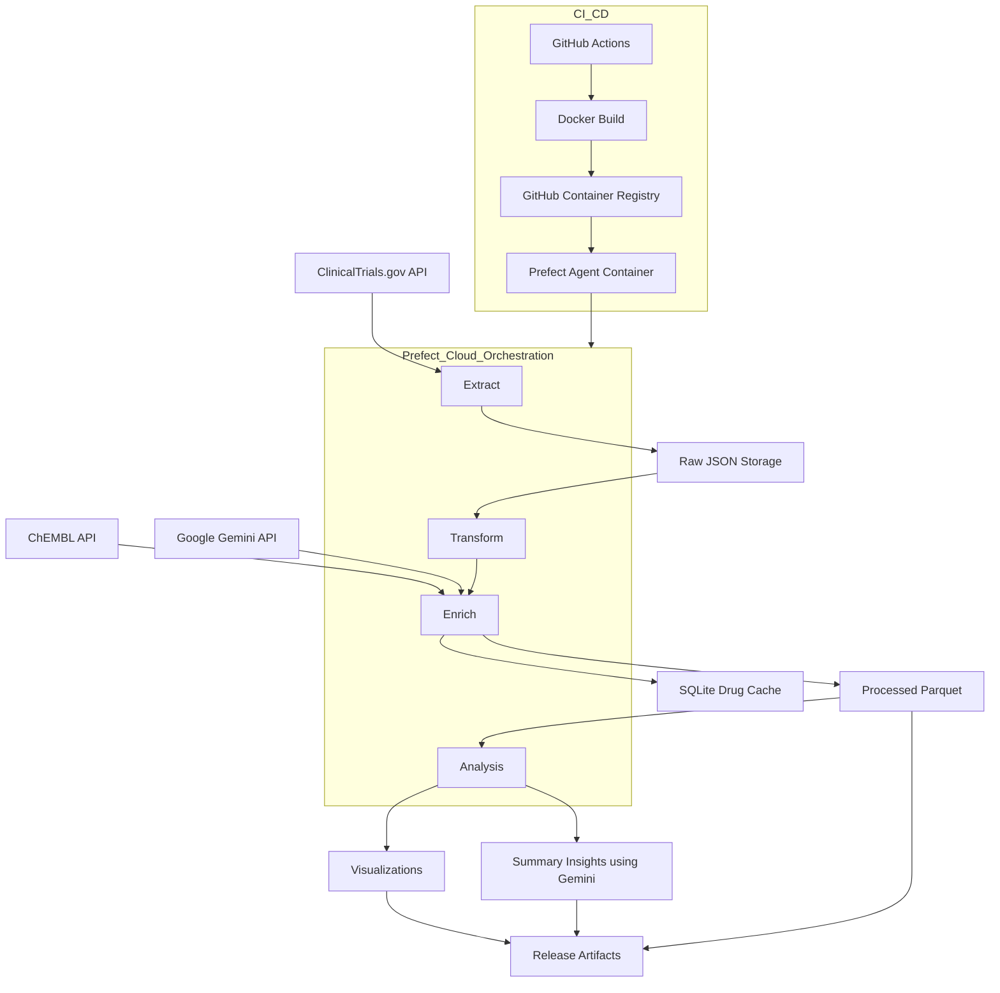

# Clinical Trials Data Pipeline

An end-to-end data pipeline for extracting, enriching, analyzing, and visualizing clinical trial data from ClinicalTrials.gov.

## Architecture




## Features

* ✅ Extracts **industry-sponsored**, **interventional**, human studies for a specified disease
* 🧠 Enriches interventions with **drug modality and target info** using:

  * 🔬 Primary: ChEMBL Python client
  * 🤖 Fallback: Google Gemini API
* 📦 Caches enrichment to **SQLite** to avoid redundant lookups
* 📊 Generates **interactive (Plotly)** and **static (Matplotlib)** visualizations
* 📝 Produces detailed **LLM-based insights reports** with Gemini
* ⚙️ Containerized using **Docker** and deployed with **GitHub Actions**
* ☁️ Orchestrated using **Prefect Cloud** (optionally migratable to Airflow or GKE)
* 📁 Release artifacts are stored locally or in cloud-ready structure

## Quick Start

### Prerequisites

* Python 3.12
* [Poetry](https://python-poetry.org/) for dependency management
* [Prefect 2](https://docs.prefect.io/) for orchestration
* Google Gemini API key (used if ChEMBL enrichment fails)

### Setup

1. Clone the repository

```bash
git clone https://github.com/yourusername/clinical_trial_pipeline.git
cd clinical_trial_pipeline
```

2. Install dependencies

```bash
poetry install
```

3. Configure environment variables (or create a `.env` file)

```bash
export DISEASE="Familial Hypercholesterolemia"
export YEAR_START=2008
export YEAR_END=2023
export GEMINI_API_KEY="your-api-key"
MAX_STUDIES = 100 # can be modified
MAX_PAGES=2 #can be modified
PREFECT_API_KEY="your-prefect-api-ke"
PREFECT_WORKSPACE="workspace_slug_here"

# When running inside Docker
BASE_PATH=/app

# When running locally, comment it out or set to current dir
 BASE_PATH=.

```

4. Run the pipeline

```bash
poetry run python -m src.pipeline.flow
```

### Using Docker (with Prefect Cloud Agent)

```bash
docker-compose up
```

## CI/CD (GitHub Actions)

This repository includes a GitHub Actions workflow that:

* Runs tests with Pytest
* Builds and validates Docker image
* Publishes image to **GitHub Container Registry (GHCR)**

> You'll need to configure `secrets.GITHUB_TOKEN` for GHCR push access.
